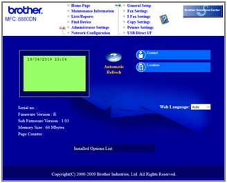
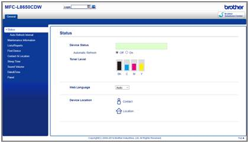
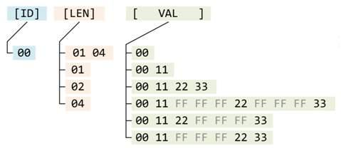
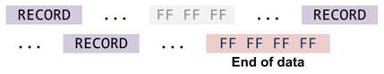

# Reverse engineering of SNMP OcetetString objects from Brother's printers

Brother printers (those with network LAN/WiFi) support SNMP for reading status, and others stuff. But unfortunately Brother don't publish in SNMP all information about printer counters (usage, remaining life, etc.) sometimes there is for drum and/or some others but there is no toner information at all.\
You can download from printer Maintenance Page in CSV format some values and then parse the file, but there is not everything either.

I noticed that all printers return in 5 or 6 MIB nodes a OctetString (an array in hex-formatted string). Eventually I figured out those OctetString layout and compared values with numbers from web UI and identified records in those OctetStrings "data blocks" :smile:

In next chapters and files you can read about my discoveries. And the data that I collected from printers that I have access to with analysis of the data.

In near future I'll write an C# .Net library and simple app for processing data from those MIB nodes.

In file: [PDF](Brother&#32;Printers&#32;SNMP&#32;OctetString&#32;nodes&#32;reverse&#32;engineering.pdf) - you'll find everything compiled all-in-one and with colors :grin: 

Revisions:
- 0.00 - Initial
- 0.01 - Rewritten data structure, added HL-L5100DN
- 0.02 - Some cleaning ;)
- 0.03 - public release

## Index

* Intro
* Data structure
* Few numbers about consumables for each printer
* MFC-L8650CDW (file: [MFC-L8650CDW.md](MFC-L8650CDW.md))
  * MFC-L8650CDW - brInfoCounter
  * MFC-L8650CDW - brInfoMaintenance
  * MFC-L8650CDW - brInfoNextCare
  * MFC-L8650CDW - brInfoReplaceCount
  * MFC-L8650CDW - brInfoJamCount
* DCP-7065DN (file: [DCP-7065DN.md](DCP-7065DN.md))
  * DCP-7065DN - brInfoCounter
  * DCP-7065DN - brInfoMaintenance
  * DCP-7065DN - brInfoNextCare
  * DCP-7065DN - brInfoReplaceCount
  * DCP-7065DN - brInfoJamCount
* MFC-8880DN (file: [MFC-8880DN.md](MFC-8880DN.md))
  * MFC-8880DN - brInfoCounter
  * MFC-8880DN - brInfoMaintenance
  * MFC-8880DN - brInfoNextCare
  * MFC-8880DN - brInfoReplaceCount
  * MFC-8880DN - brInfoJamCount
* MFC- B7715DW (file: [MFC-B7715DW.md](MFC-B7715DW.md))
  * MFC- B7715DW - brInfoCounter
  * MFC- B7715DW - brInfoCoverage
  * MFC- B7715DW - brInfoMaintenance
  * MFC- B7715DW - brInfoNextCare
  * MFC- B7715DW - brInfoReplaceCount
  * MFC- B7715DW - brInfoJamCount
* MFC-L2720DW (file: [MFC-L2720DW.md](MFC-L2720DW.md))
  * MFC-L2720DW - brInfoCounter
  * MFC-L2720DW - brInfoCoverage
  * MFC-L2720DW - brInfoMaintenance
  * MFC-L2720DW - brInfoNextCare
  * MFC-L2720DW - brInfoReplaceCount
  * MFC-L2720DW - brInfoJamCount
* HL-L5100DN (file: [HL-L5100DN.md](HL-L5100DN.md))
  * HL-L5100DN - brInfoCounter
  * HL-L5100DN - brInfoCoverage
  * HL-L5100DN - brInfoMaintenance
  * HL-L5100DN - brInfoNextCare
  * HL-L5100DN - brInfoReplaceCount
  * HL-L5100DN - brInfoJamCount

## Intro

Printers that I based my finding on (I have them at work so I can get
accurate data from them via SNMP and http):
-   Brother MFC-L8650CDW (laser color, f/w: `P / 1.02 / J1605111800 /
    1.00` )
-   Brother DCP-7065DN (laser mono, f/w: `J` )
-   Brother MFC-8880DN (laser mono, f/w: `R 1.03` )
-   Brother MFC-B7715DW (laser, mono, f/w:` H / 1.04` )
-   Brother MFC-L2720DN (laser, mono, f/w: `L / 1.06 / F1512090500` )
-   Brother HL-L5100DN (laser mono, f/w: `1.15 / 1.07` )

Printers presents in SNMP 5 or 6 objects which, I believe are direct
memory dumps of counters. Or they are just packed in bizarre way (the padding make no sense for me :anguished: - it's done so randomly...) - anyone who was coding this must smoke a really weird weeds :smirk: .

Newer printers have also coverage parameter that follows layout of
*ReplaceCount* and *JamCount* records.

Those OIDs are:
-   `1.3.6.1.4.1.2435.2.3.9.4.2.1.5.5.10` (**brInfoCounter**) -- general
    counters (pages, each color, drum, etc)
-   `1.3.6.1.4.1.2435.2.3.9.4.2.1.5.5.8` (**brInfoMaintenance**) -- mostly
    contains remaining life of consumables in percents (in 0.01 units,
    e.g.: 97.00% is encoded as 9700 integer number).
-   `1.3.6.1.4.1.2435.2.3.9.4.2.1.5.5.11` (**brInfoNextCare**) - mostly
    contains remaining life in pages of consumables and other mechanical
    elements.
-   `1.3.6.1.4.1.2435.2.3.9.4.2.1.5.5.20` (**brInfoReplaceCount**) --
    counters how many times what was replaced.
-   `1.3.6.1.4.1.2435.2.3.9.4.2.1.5.5.21` (**brInfoJamCount**) -- counters
    of paper jams ,
-   `1.3.6.1.4.1.2435.2.3.9.4.2.1.5.5.18` (**brInfoCoverage**) -- this
    contains only one record with average page coverage .

Those OIDs can be found in BROTHER-MIB module.

I distinguish the printers to two types: with the new web UI, and with
the old web UI:
-   The old is that blue page with menu on white bar at top of page:\
    
-   The new is that one with white background and menu on left side with
    some tabs at top:\
    

## Data structure

The basic record (I might call it a segment too) structure is:
* 1st byte is record ID,\
After ID there can be 2 length layouts - fortunately across all printers
the same OID follows that same structure layout, and those are those 2
different layouts:
  - **Layout 1** (apply for OIDs: *brInfoCounter* , *brInfoMaintenance*,
      *brInfoNextCare* ) - after ID there is sequence (hex) `01 04` - I
      guessing this: the `01` is some kind of flag, and `04` is a value field length in bytes,

  - **Layout 2** (apply for OIDs: *brInfoReplaceCount*, *brInfoJamCount*,
      *brInfoCoverage*): after ID there is 1 byte that define value field
      length: `01` = 1 byte, `02` = 2 bytes ("word"), `04` = 4 bytes (dword / integer).

After length field(s), there is a value 1,2 or 4 bytes long, and this is
where starting weird things happens (someone muse have smoked really
weird weeds :weary: ), value can be split after 2nd and/or 3rd
byte by sequence of 3xFF (3 times 0xFF).

The value field can have:
-   a counter value in pages,
-   percentage value in 1% resolution,
-   percentage value in 0.01% resolution,
-   percentage value in 2 bytes, where MSB byte is integer part, and LSB
    byte is decimal part (`.00` - `.99`) -- field can be declared as word/dword value type,
-   status value (usually a 1 byte but field is declared as dword value
    type),

Sometime after the record show up the 3xFF sequence too, also the 3xFF
sequence can be placed right at the beginning of whole data block (e.g.
brInfoNextCare or brInfoReplaceCount) .

At the end of data block there is sequence of 4xFF (4 time 0xFF)
indicating end of data - I call it `padEnd` :wink: .

Data block layouts:

For brInfoNextCare or brInfoReplaceCount it's:

I think for parsing the byte-stream: I'd first strip the stream from
End-Of-Data field, and then cut out all 3xFF sequences (0xFFFFFF =
16'777'215(dec) -- I don't think there would be a printer with that
value in any counter). After that we get a nice clean data block .

 ## Few numbers about consumables for each printer 

### MFC-L8650CDW consumables:

|**P/N** |**Description** |**Life** |
|-|-|-|
|BU320CL| Transfer belt   |  `50 000 p` |
|DR321CL| Drum unit       |  `25 000 p` |
|TN321BK| Toner, black    |  `2 500 p ` |
|TN321C/-M/-Y  | Toner, color    |  `1 500 p ` |
|TN326BK       | Toner, black    |  `4 000 p ` |
|TN326C/-M/-Y  | Toner, color    |  `3 500 p ` |
|WT-320CL      | Waste box toner |  `50 000 p` |

### DCP-7065DN consumables:

|**P/N**  | **Description**  | **Life**|
|---------| -----------------| --------|
|DR2200   | Drum unit        | `12 000 p`|
|TN2220   | Toner, black     | `2 600 p `|

### MFC-8880DN consumables:

|**P/N**   |**Description**   |**Life**|
|--------- |----------------- |--------|
|DR3200    |Drum unit         |`25 000 p`|
|TN3280    |Toner, black      |`8 000 p `|

### HL-L5100DN consumables:

|**P/N**   |**Description**   |**Life**|
|--------- |----------------- |--------|
|DR3400    |Drum unit         |`50 000 p`|
|TN3480    |Toner, black      |`8 000 p `|

### MFC-B7715DW consumables:

|**P/N**   |**Description**  |**Life**|
|--------- |-----------------|--------|
|DR-B023   |Drum unit        |`12 000 p`|
|TN-B023   |Toner, black     |`2 000 p `|

### MFC-L2720DW consumables:

|**P/N**  |**Description**  |**Life**|
|---------|-----------------|--------|
|DR2300   |Drum unit        |`12 000 p`|
|TN2320   |Toner, black     |`2 600 p `|

# Printer descriptions
* [MFC-L8650CDW](MFC-L8650CDW.md) - MFC-L8650CDW.md
* [DCP-7065DN](DCP-7065DN.md) - DCP-7065DN.md
* [MFC-8880DN](MFC-8880DN.md) - MFC-8880DN.md
* [MFC-B7715DW](MFC-B7715DW.md) - MFC-B7715DW.md
* [MFC-L2720DW](MFC-L2720DW.md) - MFC-L2720DW.md
* [HL-L5100DN](HL-L5100DN.md) - HL-L5100DN.md

# License
Beerware.

# EOF
Copyright©2019 Przemyslaw W. \[saper\_2\]

